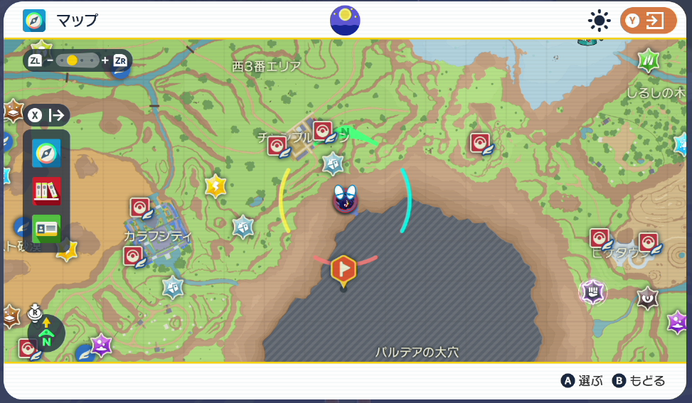

# SVAutoHatch
Program for automatic hatching in Pokémon SV.

## 概要
本プログラムはSVにて自動で孵化作業を行うプログラムです。
本プログラムを作成するにあたり、自動化勉強会＆交流サーバーに公開されている皆様のプログラムを参考させていただきました。
先駆者の皆様、心より感謝申し上げます。

## 前提条件
- Poke-Controller-Modified導入済み
- 画像フォルダTemplate/SVAutoHatchをSerialController/Template/に配置してください
- 画面サイズは1280x720以下(推奨)

## 事前準備
- 初期立ち位置はゼロゲート(地上)
- 最初に表示されるボックスとそれより右のボックスは孵化BOX数分空にしておく
- 最初に表示されるボックスの左のボックスの一番左上に特性「ほのおのからだ」のポケモンを配置する
- 手持ちに孵化させる2匹のポケモンを加えておく(手持ち先頭にミライドン/コライドンがいる場合でも動作可能、孵化効率は落ちます)
- スーパーピーナッツバターサンドの材料を孵化させるBOX数以上持っていること
- 以下画像の位置にピンを指しておく(多少ずれても問題ありません)

## 注意事項
- 調理移動量は環境によって異なるため適宜調整が必要です
- うまく動作しない場合はそれぞれの画像を自身の環境で作成し直してください
- それでもうまく動作しない場合は動作安定化に数値を設定してみてください

## スペシャルサンクス
自動化勉強会＆交流サーバーの皆様

## developed
- Twitter: [_cttr](https://twitter.com/_cttr)
- TN: えりち
